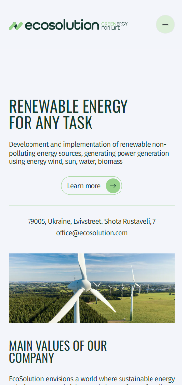
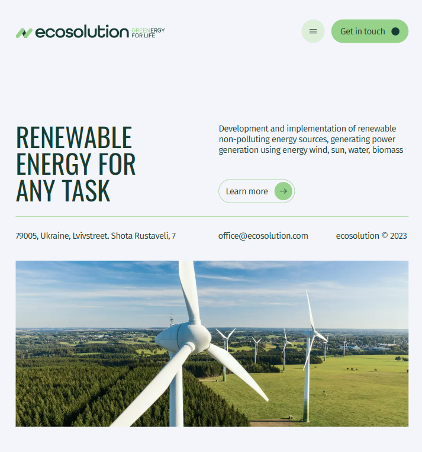
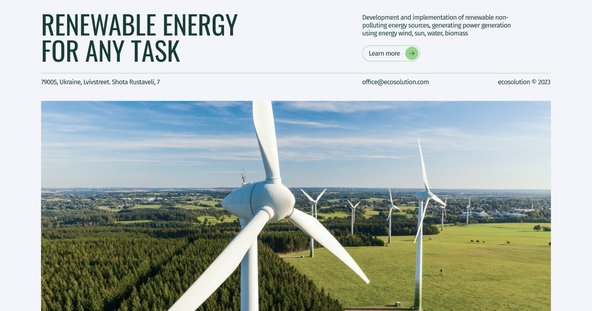

# EcoSolution

Site says about development and implementation of renewable non-polluting energy sources, generating power generation using energy wind, sun, water, biomass. EcoSolution envisions a world where sustainable energy solutions power a brighter and cleaner future for all. We aspire to be at the forefront of the global shift towards renewable energy, leading the way in innovative technologies that harness the power of nature to meet the world's energy needs.

## Project Overview

This project was built using a combination of technologies, including Next.js 13 and Tailwind CSS.

## Technologies Used

- **Next.js 13:** Utilized for routing and server-side rendering.
- **Tailwind CSS:** Used for responsive and efficient styling.

## Layout

- Fixed layout in pixels (px).
- Semantic and valid structure.
- Responsive and cross-browser compatible design:

  - Mobile devices from 360px.

    

  - Tablets from 768px.

    

  - Desktops from 1280px.

    

    ## Functionality

### Header

- Fixed header with a logo and navigation menu.
- Navigation menu with links to various sections.
- Change the header color on scroll.
- Utilized the **react-scroll** library for smooth navigation.

### Main

- Clicking "Learn more" smoothly scrolls to the "Cases" section.

### About (Values)

- Utilize the CSS Grid algorithm for the layout.

### Electricity

- Implementing an automatic counter, adding +1 per second.

### Cases

- Slider wath implemented using **Swiper**.
- Implementing an infinite slider,where slides change by clicking the corresponding buttons or through dragging.

### FAQ

- By default, have the first answer open but you can toggle them by click.
- Clicking "Contact Us" should trigger a smooth scroll to the "Contact" section.

### Contact

- Form validation with **react-hook-form** and **Tailwind CSS** for error styling.
- Implementing **react-hook-form-persist** and **react-hot-tost** for saving and showing of data.

### Footer

- Clicking arrow triggers a smooth scroll to the "Main" section.

## Running the Project

To run the project, follow these steps:

1. Clone the project repository to your local computer.

2. Open a terminal and navigate to the project folder.

3. Execute the following commands:

   ```shell
   # Install project dependencies
   npm install

   # Start the development server
   npm run dev
   ```

The project will be accessible at http://localhost:3000.
